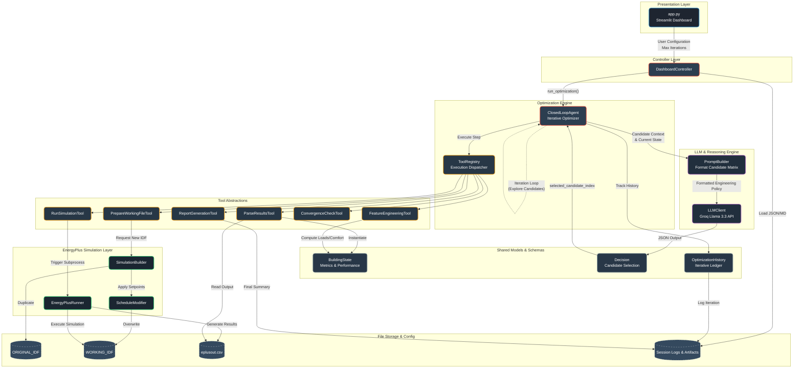

# Honeywell Eco-Loop Building Agents

An AI-driven closed-loop orchestration engine that uses Large Language Models (LLMs) to empirically optimize HVAC energy consumption while maintaining building occupant comfort. Developed for the **Honeywell Hackathon**.

<p align="center">
  
  
  
  
</p>

---

## Project Overview

Eco-Loop is a sophisticated orchestration pipeline demonstrating the integration of **LLM-based decision-making engines** with **deterministic physics simulators** (EnergyPlus). 

Instead of relying on LLMs for "blind" numerical guessing (which often results in hallucinations), this project implements a rigorous **Simulation-Guided Agent Architecture**. The agent autonomously evaluates a generated grid of potential thermostat candidates, dispatches parallel/sequential simulations via a central Tool Registry, and then uses a custom Prompt Builder to instruct the LLM (Groq Llama 3.3) to make data-backed engineering decisions.

**Key Technical Achievements:**
- **State-Machine Orchestration:** Built a stateless pipeline that eliminates data-drift by mapping simulations to distinct cache keys and ephemeral directories, allowing completely isolated iteration cycles.
- **Agentic Tooling & Delegation:** Hand-rolled a `ToolRegistry` pattern that decouples the execution of external subprocesses (EnergyPlus), file parsing (CSV outputs), and mathematical metric engineering from the agent's core decision loop.
- **Empirical LLM Reasoning:** Designed an engineering policy parser where the LLM evaluates a mathematical matrix of physical outcomes (Total Energy Wh, Peak Load, Comfort %) rather than raw temperature rules.
- **Robust Error Handling:** Built resilient diagnostics into subprocess execution. If the building physics engine faults (e.g., HVAC deadband violations), the pipeline captures internal EnergyPlus `** Severe **` errors, propagates the Python stack trace gracefully, and relays it natively back to the UI.
- **Streamlit Dashboard:** Developed a responsive, real-time tracking interface showing iteration progression, convergence metrics, and energy savings reports.

---

## Architecture Design



The system runs on four core layers, all written in modular, testable Python:

### 1. Optimization Orchestrator (`ClosedLoopAgent`)
The engine of the project. It implements a fully automated iterative loop:
1. Generates valid spatial boundary candidates (`[-0.5, 0.0, 0.5]` deltas in Heating/Cooling bounds).
2. Performs simulation caching to prevent redundant execution of identical physical states.
3. Consolidates the evaluated empirical data of each candidate.
4. Uses Groq's LLM to return a validated JSON schema selecting the optimal configuration based on priority ranking.

### 2. Simulation & File Subsystem
- **Stateless Execution:** Rebuilds an `.idf` (EnergyPlus format) file from scratch per iteration using `SimulationBuilder`.
- **Subprocess Management:** `EnergyPlusRunner` utilizes `subprocess` libraries to stream execution logs and diagnose C++ exit codes safely.

### 3. Pydantic Models & Data Schemas
Ensures type safety across the entire application. The raw simulator CSV is mapped to a `BuildingState` object, while the LLM is forced to return a strictly typed `Decision` object consisting of a `selected_candidate_index`, a reasoning string, and a confidence float.

### 4. Interactive UI
A beautiful Streamlit dashboard visualizes the closed-loop progression, displaying detailed logs of historical candidate choices, runtimes, energy reductions, and temperature trends in a sleek Dark Mode UI.

---

## How to Run Locally

### Prerequisites
- Python 3.10+
- EnergyPlus (Ensure `energyplus` is available in your system path)
- Groq API Key

### Installation

```bash
# 1. Clone the repository
git clone https://github.com/your-username/eco-loop-building-agents.git
cd eco-loop-building-agents

# 2. Create and activate a virtual environment
python -m venv .venv
source .venv/bin/activate  # On Windows use: .venv\Scripts\activate

# 3. Install dependencies
pip install -r requirements.txt

# 4. Set up environment variables
# Create a .env file and add your Groq API key:
echo "GROQ_API_KEY=your_key_here" > .env
```

### Execution

```bash
# Start the Streamlit Dashboard
streamlit run app.py
```

Navigate to `http://localhost:8501` to use the interactive application.

---

## Why This Stands Out

This project moves beyond standard RAG or basic chatbot implementations. It is an **Agentic AI System** dealing with autonomous loop control, physical simulation integration, state persistence, strict schema validation, and failure-tolerant architecture design. It showcases backend system design, prompt engineering, and UI development—a complete full-stack AI engineering deliverable.
